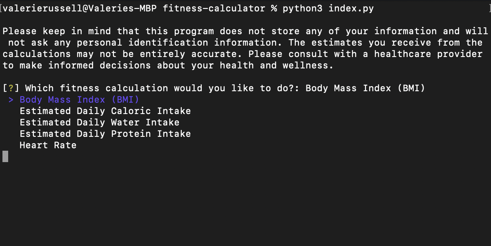
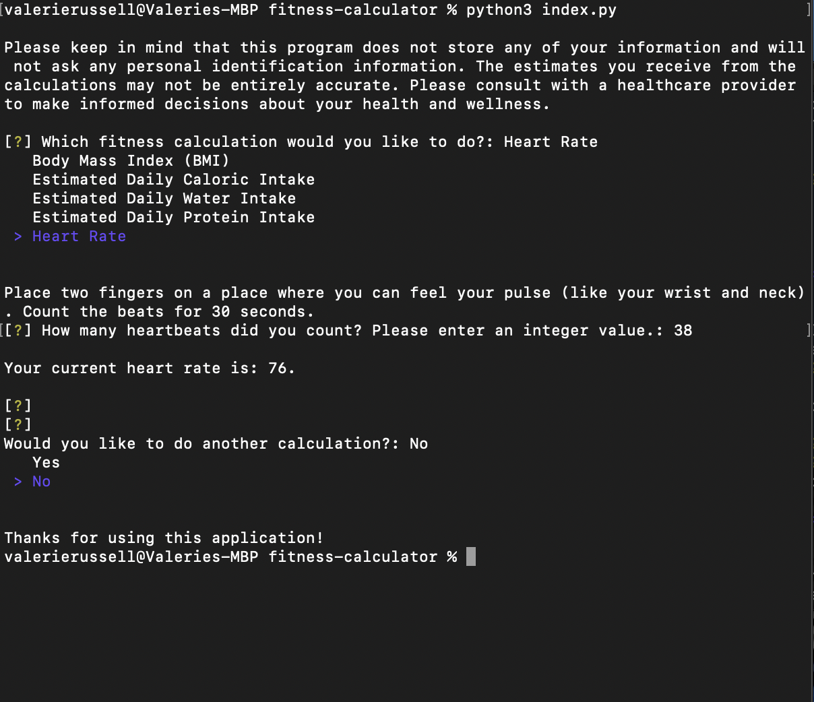

# Fitness Calculator

## Overview

A CLI solution built with Python for calculating fitness measurements such as body mass index (BMI), estimated protein intake recommendations, and heart rate.

## Description

This project empowers fitness-conscious users by providing them with relevant data, tailored to their individual needs, in an efficient way (while also preserving their privacy). Knowing calculations such as a recommended protein or water intake can be useful not only for athletes, but for anyone interested in their health and wellness. While the best data comes through consulting with a healthcare provider that knows more information about a person's health, these calculations are an efficient way to get estimates that may be useful.

Several basic concepts in Python are incorporated within this program, including importing an external module, conditional execution, dictionaries (and accessing values through keys), number and string conversions, and mathematical calculations. I was able to build the program fairly quickly, and appreciated the opportunity to work with several dictionaries. The syntax for dictionaries is slightly different than JavaScript objects, and so I was glad to develop a stronger understanding of how to access values (user inputs) through keys. I also learned how to install an external module, inquirer, rather than rely solely on Python's internal libraries. I chose to import inquirer since it provides a straightforward way to ask for a user's input with a select number of choices (preventing errors/misunderstandings when entering information).

Overall, this was an interesting project to build and I enjoyed learning more about Python fundamentals as well as the strengths and limitations of various modern fitness calculations.

## Technologies Used

- Python
- Inquirer

## Installation

To run the application, clone the repository and navigate to the correct working directory. Next, run ```python3 index.py``` to start the main menu.
## Usage

This program involves several simple calculations for health and fitness estimates. It is not intended to diagnose or offer medical advice. For health-related questions and concerns, please contact a local healthcare provider.

**Below is a screenshot CLI's main menu:**



**Below is what the CLI looks like when calculating heart rate:**



## Credits

Valerie Russell was the sole contributor to this project. Contact her at vruss14@gmail.com.

### References

* [CDC: Calculating BMI Using the English System](https://www.cdc.gov/nccdphp/dnpao/growthcharts/training/bmiage/page5_2.html)
* [CDC: How to Measure and Interpret Weight Status](https://www.cdc.gov/healthyweight/assessing/index.html)
* [Check Your Health (Caloric Intake)](https://www.checkyourhealth.org/eat-healthy/cal_calculator.php)
* [Trifecta Nutrition: Daily Water Needs](https://www.trifectanutrition.com/water-intake-calculator#:~:text=Your%20general%20water%20requirements%20can,ounces%20of%20water%20each%20day)
* [Trifecta Nutrition: Protein Calculator](https://www.trifectanutrition.com/protein-calculator)
* [Heart Rate Estimate](https://www.healthlinkbc.ca/health-topics/tx4374)